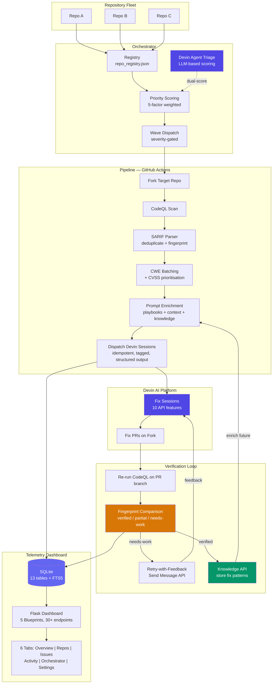
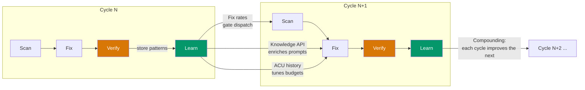

# CodeQL Devin Fixer -- 5-Minute Demo Path

> **Audience:** Enterprise security teams evaluating automated vulnerability remediation at scale.
>
> **Key message:** This platform uses Devin AI to **control the security entropy of large codebases** -- not just finding and fixing what one scan turns up, but orchestrating continuous remediation across repository fleets with learning, verification, and cost optimisation built into every layer.

---

## Demo Flow (5 minutes)

### 0:00 -- 0:30 | The Problem

> "Every enterprise security team faces the same challenge: static analysis tools find hundreds of vulnerabilities, but fixing them is manual, slow, and doesn't scale. The backlog grows faster than teams can remediate. What if you could close that gap automatically?"

Open the [telemetry dashboard](https://marius-posa.github.io/codeql-devin-fixer/) Overview tab. Point to the metric cards showing total issues found, sessions dispatched, and verified fixes.

> "This is CodeQL Devin Fixer -- an end-to-end platform that scans repositories with CodeQL, prioritises findings by real-world exploitability, and dispatches Devin AI agents to create verified fix PRs. No human in the loop."

### 0:30 -- 1:30 | Beyond the Initial Prompt

> "The original brief was simple: write a GitHub Action that fixes CodeQL issues using Devin. What we built goes far beyond that."

Show the architecture diagram (below) or open `docs/architecture.md`.

> "This isn't a single script. It's **five integrated subsystems**: a GitHub Actions pipeline, a multi-repo orchestrator, a Flask telemetry dashboard, a GitHub App for webhook automation, and deep integration with 10 Devin API features."

**Key stats to mention:**
- ~27,000 lines of Python across pipeline, orchestrator, dashboard, and GitHub App
- 32 test files / 11,500 lines of tests
- 13-table SQLite database with full-text search
- 6 solution reviews driving iterative architectural improvements
- 125+ merged PRs

### 1:30 -- 2:30 | The Closed Loop -- How Fixes Are Verified

Navigate to the **Activity** tab. Click on a session to show its details.

> "Most AI-powered fix tools are fire-and-forget -- they generate a PR and hope it works. We built a **closed verification loop**."

Walk through the cycle:

1. **Scan** -- CodeQL analyses the target repo and outputs SARIF
2. **Batch** -- Issues are grouped by CWE family (injection, XSS, crypto, etc.) so Devin can fix related issues together
3. **Dispatch** -- Devin sessions are created with CWE-specific playbooks, repository context, and knowledge from past fixes
4. **Verify** -- CodeQL re-runs on the PR branch and compares stable fingerprints to objectively confirm each issue is resolved
5. **Learn** -- Successful fix patterns are stored in the Devin Knowledge API; failed fixes trigger retry-with-feedback via the Send Message API

> "The result: objective proof that vulnerabilities are gone, not just that the code compiles."

### 2:30 -- 3:30 | Enterprise Scale -- Multi-Repo Orchestration

Switch to the **Orchestrator** tab. Show the repo registry and priority scoring.

> "For an enterprise with hundreds of repos, you need more than a one-repo-at-a-time tool. The orchestrator manages your entire fleet."

Highlight:

- **Priority scoring** -- 5-factor weighted formula: repo importance (35%), CVSS severity (30%), SLA urgency (15%), fix feasibility from historical data (10%), recurrence count (10%)
- **Wave-based dispatch** -- Critical issues first; if the fix rate drops below threshold, subsequent waves halt to conserve resources
- **SLA tracking** -- Critical: 24h, High: 72h, Medium: 168h, Low: 720h -- with at-risk and breached status indicators
- **Cross-repo triage** -- The orchestrator can discover common vulnerability patterns across repos that single-repo tools miss entirely

> "This isn't just fixing whatever showed up in one scan. It's a strategy for controlling security entropy across your entire codebase."

### 3:30 -- 4:15 | Learning and Cost Optimisation

Switch to the **Issues** tab. Show the fingerprint-based issue lifecycle (new -> recurring -> fixed -> verified).

> "The platform gets smarter and cheaper over time."

Highlight three mechanisms:

1. **Knowledge API** -- When a fix is verified, the pattern is extracted and stored. Future sessions for the same CWE family receive this context, improving fix rates
2. **Fix learning** -- Historical fix rates by CWE family drive adaptive dispatch. Low-success families are deprioritised or skipped to save ACU budget
3. **Dynamic ACU budgets** -- Machine type and ACU limits are auto-selected based on repo size, issue severity, and historical consumption

> "Every cycle produces data that makes the next cycle more effective and less expensive."

### 4:15 -- 4:45 | Creative Use of Devin

> "We don't just call the Devin API to create sessions. We use 10 of 12 documented API features."

Quickly highlight the most creative:

- **Devin-as-Orchestrator** -- A Devin session that triages issues using LLM reasoning, producing per-issue priority scores alongside the deterministic scorer. Devin reasons about *which code to fix and when*, not just *how to fix it*
- **CWE Playbooks synced via Playbooks API** -- Structured, auditable fix instructions per vulnerability family, pushed to Devin's native playbook system
- **Retry-with-feedback** -- Verification failures are sent back to active sessions via the Send Message API for iterative improvement
- **Structured output schema** -- Real-time tracking of which issues Devin is attempting, has fixed, or is blocked on

### 4:45 -- 5:00 | One-Click Deployment

> "You can start using this today."

Show `app-manifest.json` in the repo.

> "Install as a **GitHub App** on your organisation -- webhook-driven scanning on every push. The telemetry dashboard deploys via Docker or Helm. The orchestrator runs on a schedule via GitHub Actions. And everything is configurable: per-repo YAML overrides, registry-level scheduling, and dashboard environment variables."

Mention: rate limiting, audit logging, server-side sessions, CORS restriction, prompt-injection defense, OAuth authentication -- production-grade from day one.

---

## Architecture Diagram



## Learning and Optimisation Cycle



---

## Dimensions Scorecard

| Dimension | How This Solution Delivers |
|---|---|
| **Creative Devin usage** | 10 of 12 API features used. Devin-as-Orchestrator pattern: a Devin session triages issues for other Devin sessions. Playbooks API sync, Knowledge API for organisational memory, Send Message API for retry-with-feedback, structured output for real-time tracking. |
| **Architecture complexity** | 5 subsystems evolved through 6 solution reviews and 125+ PRs. Blueprint-based Flask app, 13-table SQLite DB, typed pipeline config, modular orchestrator package. |
| **Enterprise multi-repo** | Orchestrator with registry, per-repo config, priority scoring, wave dispatch, SLA tracking, cooldown logic, and cross-repo vulnerability pattern detection. |
| **Improves over time** | Knowledge API stores verified fix patterns. Fix learning analyses historical rates by CWE family. Dynamic ACU budgets adapt to observed consumption. Wave gating stops spending when fixes are unlikely. |
| **Code resilience** | 32 test files / 11,500 lines covering pipeline, orchestrator, telemetry, and integrations. Rate limiting, audit logging, prompt-injection defense, retry with exponential backoff. |
| **Shareable as GitHub App** | `app-manifest.json` for one-click installation. Webhook-driven scanning on push events. Docker + Helm deployment for the dashboard. Setup script for guided onboarding. |

---

## Quick Reference -- What to Show

| Timestamp | What to Show | Where |
|---|---|---|
| 0:00 | Dashboard Overview tab -- metric cards and trend chart | [Live Dashboard](https://marius-posa.github.io/codeql-devin-fixer/) |
| 0:30 | Architecture diagram | This file or `docs/architecture.md` |
| 1:30 | Activity tab -- session details, PR links | Dashboard Activity tab |
| 2:30 | Orchestrator tab -- registry, priority scores, wave controls | Dashboard Orchestrator tab |
| 3:30 | Issues tab -- fingerprint lifecycle, SLA status | Dashboard Issues tab |
| 4:15 | `scripts/orchestrator/agent.py` -- Devin-as-Orchestrator | Repository source |
| 4:45 | `app-manifest.json` -- GitHub App install | Repository root |

---

## Running the Demo Locally

```bash
# Dashboard with demo data
cd telemetry
pip install -r requirements.txt
python app.py
# Open http://localhost:5000 -> Settings tab -> Load Demo Data

# Orchestrator dry-run
python -m scripts.orchestrator plan --json

# Full pipeline (requires DEVIN_API_KEY and GH_PAT)
# Trigger via GitHub Actions: .github/workflows/codeql-fixer.yml
```

---

## References

- [Architecture docs](docs/architecture.md)
- [Configuration reference](docs/CONFIG_REFERENCE.md)
- [Live Dashboard (GitHub Pages)](https://marius-posa.github.io/codeql-devin-fixer/)
- [Solution Reviews V1-V6](docs/) -- documenting the evolution from prototype to platform
