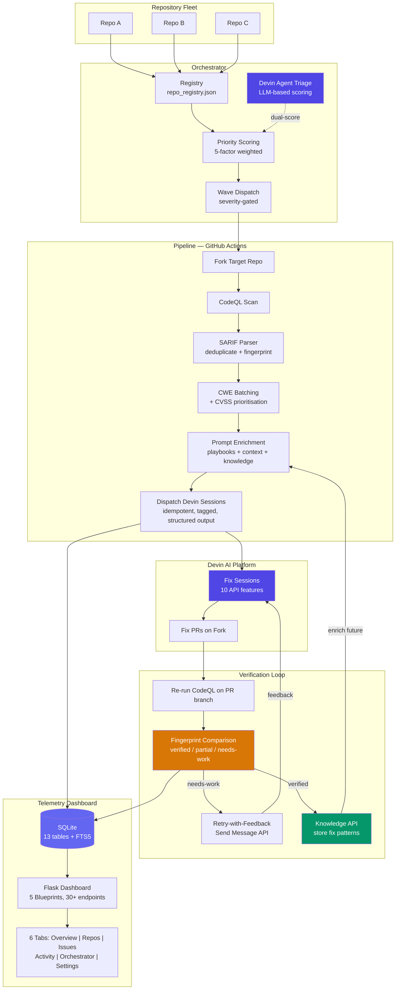
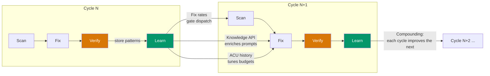

# CodeQL Devin Fixer -- 5-Minute Demo Path

> **Audience:** Enterprise security teams evaluating automated vulnerability remediation at scale.
>
> **Key message:** This platform uses Devin AI to **control the security entropy of large codebases** -- not just finding and fixing what one scan turns up, but orchestrating continuous remediation across repository fleets with learning, verification, and cost optimisation built into every layer.

---

## Demo Flow (5 minutes)

### 0:00 -- 0:45 | The Problem and Why Devin

> "Every enterprise security team faces the same challenge: static analysis tools find hundreds of vulnerabilities, but fixing them is manual, slow, and doesn't scale. The backlog grows faster than teams can remediate. What if you could close that gap automatically?"

Open the [telemetry dashboard](https://marius-posa.github.io/codeql-devin-fixer/) Overview tab. Point to the metric cards showing total issues found, sessions dispatched, and verified fixes.

> "This is CodeQL Devin Fixer -- an end-to-end platform that scans repositories with CodeQL, prioritises findings by real-world exploitability, and dispatches Devin AI agents to create verified fix PRs."

> "Why Devin? Security remediation is the ideal problem for an autonomous coding agent. Each fix requires reading surrounding code, understanding the vulnerability class, applying an idiomatic patch, and running tests -- tasks that demand a full development environment, not just text completion. Devin is the right fit because it provides **persistent sandboxed environments** where an agent can clone a repo, install dependencies, edit code, and run a test suite end-to-end. Its **API-first design** -- sessions, Knowledge API, Send Message API, Playbooks API, structured output, attachments -- lets us build a multi-agent orchestration layer on top: one agent triages, many agents fix, and the platform verifies. No other coding tool offers this combination of autonomy, programmability, and feedback integration."

### 0:45 -- 1:30 | Beyond the Initial Prompt

> "The original brief was simple: write a GitHub Action that fixes CodeQL issues using Devin. What we built goes far beyond that."

Show the architecture diagram (below) or open `docs/architecture.md`.

> "This isn't a single script. It's **five integrated subsystems** -- a GitHub Actions pipeline, a multi-repo orchestrator, a Flask telemetry dashboard, a GitHub App for webhook automation, and deep integration with 10 of 12 Devin API features -- evolved through 6 solution reviews and 125+ merged PRs."

Devin's features map directly to the product's capabilities:

| Devin Feature | What It Enables |
|---|---|
| **Persistent sandbox** | Clone target repos, install CodeQL, run full scans and test suites inside each fix session |
| **Knowledge API** | Store verified fix patterns so future sessions for the same CWE family start with proven context |
| **Send Message API** | Feed verification failures back into active sessions for iterative retry-with-feedback |
| **Playbooks API** | Push CWE-specific fix instructions into Devin's native playbook system for auditable, consistent guidance |
| **Structured output** | Real-time tracking of which issues each session is attempting, has fixed, or is blocked on |
| **Attachments API** | Upload batch JSON and source file context directly into each session |
| **Idempotent sessions** | Safe retries -- restarting a dispatch cycle never duplicates work |
| **Tags + machine selection** | Route sessions by severity tier and auto-select machine size based on repo complexity |

### 1:30 -- 2:30 | The Closed Loop -- How Fixes Are Verified

Navigate to the **Activity** tab. Click on a session to show its details.

> "Most AI-powered fix tools are fire-and-forget -- they generate a PR and hope it works. We built a **closed verification loop**."

Walk through the cycle:

1. **Scan** -- CodeQL analyses the target repo and outputs SARIF
2. **Batch** -- Issues are grouped by CWE family (injection, XSS, crypto, etc.) so Devin can fix related issues together
3. **Dispatch** -- Devin sessions are created with CWE-specific playbooks, repository context, and knowledge from past fixes
4. **Verify** -- CodeQL re-runs on the PR branch and compares stable fingerprints to objectively confirm each issue is resolved
5. **Learn** -- Successful fix patterns are stored in the Devin Knowledge API; failed fixes trigger retry-with-feedback via the Send Message API

> "The result: objective proof that vulnerabilities are gone, not just that the code compiles."

### 2:30 -- 3:30 | Multi-Agent Orchestration at Enterprise Scale

Switch to the **Orchestrator** tab. Show the repo registry and priority scoring.

> "For an enterprise with hundreds of repos, you need more than a one-repo-at-a-time tool. This is where the multi-agent architecture comes in."

Highlight the **triage-and-dispatch workflow**:

1. **Triage agent** -- A dedicated Devin session receives the full issue inventory (fingerprints, CWE families, severity, SLA deadlines, historical fix rates, ACU budget) and uses LLM reasoning to produce per-issue priority scores and dispatch recommendations. This agent decides *what to fix and when* -- not just *how*.
2. **Deterministic scorer** -- A 5-factor weighted formula runs in parallel: repo importance (35%), CVSS severity (30%), SLA urgency (15%), fix feasibility (10%), recurrence count (10%). The triage agent's scores are merged with these for a dual-scoring system.
3. **Wave dispatch** -- Issues are dispatched in severity-gated waves. Each wave of fix sessions runs concurrently. If the fix rate drops below threshold, subsequent waves halt to conserve resources.
4. **Fix agents** -- Individual Devin sessions receive CWE-specific playbooks, repository context, and knowledge from past verified fixes. Each operates in its own sandbox.

> "One agent triages across your entire fleet, many agents fix in parallel, and the platform verifies every result. This isn't just fixing whatever showed up in one scan -- it's a strategy for controlling security entropy across your entire codebase."

Also highlight:
- **SLA tracking** -- Critical: 24h, High: 72h, Medium: 168h, Low: 720h -- with at-risk and breached status indicators
- **Cross-repo pattern detection** -- The orchestrator discovers common vulnerability patterns across repos that single-repo tools miss entirely
- **Self-scanning** -- The platform is configured to scan its own codebase (`codeql-devin-fixer` is in its own repo registry), keeping its own security posture under continuous review

### 3:30 -- 4:15 | Learning and Cost Optimisation

Switch to the **Issues** tab. Show the fingerprint-based issue lifecycle (new -> recurring -> fixed -> verified).

> "The platform gets smarter and cheaper over time."

Highlight three mechanisms:

1. **Knowledge API** -- When a fix is verified, the pattern is extracted and stored. Future sessions for the same CWE family receive this context, improving fix rates
2. **Fix learning** -- Historical fix rates by CWE family drive adaptive dispatch. Low-success families are deprioritised or skipped to save ACU budget
3. **Dynamic ACU budgets** -- Machine type and ACU limits are auto-selected based on repo size, issue severity, and historical consumption

> "Every cycle produces data that makes the next cycle more effective and less expensive."

### 4:15 -- 4:45 | Resilience and Testing

> "Enterprise-grade means production-grade reliability."

Highlight the testing and resilience story:

- **32 test files / 11,500 lines of tests** covering every subsystem: SARIF parsing, fingerprinting, pipeline config, dispatch logic, verification, orchestrator planning and state management, Flask routes and database aggregation, GitHub App webhooks and auth, fix learning, playbook management, repo context enrichment, and end-to-end integration
- **Retry with exponential backoff** on all external API calls (Devin, GitHub, CodeQL)
- **Prompt-injection defense** -- all inbound text is sanitised before being included in Devin prompts
- **Audit logging** -- every action is recorded for compliance and post-incident review
- **Rate limiting, CORS restriction, server-side sessions** -- the telemetry dashboard is hardened for production deployment

### 4:45 -- 5:00 | One-Click Deployment

> "You can start using this today."

Show `app-manifest.json` in the repo.

> "Install as a **GitHub App** on your organisation -- webhook-driven scanning on every push. The telemetry dashboard deploys via Docker or Helm. The orchestrator runs on a schedule via GitHub Actions. And everything is configurable: per-repo YAML overrides, registry-level scheduling, and dashboard environment variables."

---

## Architecture Diagram



## Learning and Optimisation Cycle



---

## Dimensions Scorecard

| Dimension | How This Solution Delivers |
|---|---|
| **Creative Devin usage** | 10 of 12 API features used. **Multi-agent triage-and-dispatch**: a Devin triage session reasons about the full issue inventory and decides what to fix; many Devin fix sessions execute in parallel. Playbooks API sync, Knowledge API for organisational memory, Send Message API for retry-with-feedback, structured output for real-time tracking, attachments for context injection. |
| **Architecture complexity** | 5 subsystems evolved through 6 solution reviews and 125+ PRs. Blueprint-based Flask app, 13-table SQLite DB, typed pipeline config, modular orchestrator package. |
| **Enterprise multi-repo** | Orchestrator with registry, per-repo config, priority scoring, wave dispatch, SLA tracking, cooldown logic, and cross-repo vulnerability pattern detection. |
| **Improves over time** | Knowledge API stores verified fix patterns. Fix learning analyses historical rates by CWE family. Dynamic ACU budgets adapt to observed consumption. Wave gating stops spending when fixes are unlikely. |
| **Code resilience** | 32 test files / 11,500 lines covering SARIF parsing, fingerprinting, dispatch, verification, orchestrator state, Flask routes, DB aggregation, GitHub App webhooks, fix learning, playbooks, and integration flows. Rate limiting, audit logging, prompt-injection defense, retry with exponential backoff. |
| **Shareable as GitHub App** | `app-manifest.json` for one-click installation. Webhook-driven scanning on push events. Docker + Helm deployment for the dashboard. Setup script for guided onboarding. |

---

## Quick Reference -- What to Show

| Timestamp | What to Show | Where |
|---|---|---|
| 0:00 | Dashboard Overview tab -- metric cards and trend chart | [Live Dashboard](https://marius-posa.github.io/codeql-devin-fixer/) |
| 0:45 | Architecture diagram + Devin feature mapping table | This file or `docs/architecture.md` |
| 1:30 | Activity tab -- session details, PR links | Dashboard Activity tab |
| 2:30 | Orchestrator tab -- registry, priority scores, wave controls | Dashboard Orchestrator tab |
| 3:30 | Issues tab -- fingerprint lifecycle, SLA status | Dashboard Issues tab |
| 4:15 | Test suite overview -- `tests/` directory | Repository source |
| 4:45 | `app-manifest.json` -- GitHub App install | Repository root |

---

## Running the Demo Locally

```bash
# Dashboard with demo data
cd telemetry
pip install -r requirements.txt
python app.py
# Open http://localhost:5000 -> Settings tab -> Load Demo Data

# Orchestrator dry-run
python -m scripts.orchestrator plan --json

# Full pipeline (requires DEVIN_API_KEY and GH_PAT)
# Trigger via GitHub Actions: .github/workflows/codeql-fixer.yml
```

---

## References

- [Architecture docs](docs/architecture.md)
- [Configuration reference](docs/CONFIG_REFERENCE.md)
- [Live Dashboard (GitHub Pages)](https://marius-posa.github.io/codeql-devin-fixer/)
- [Solution Reviews V1-V6](docs/) -- documenting the evolution from prototype to platform
